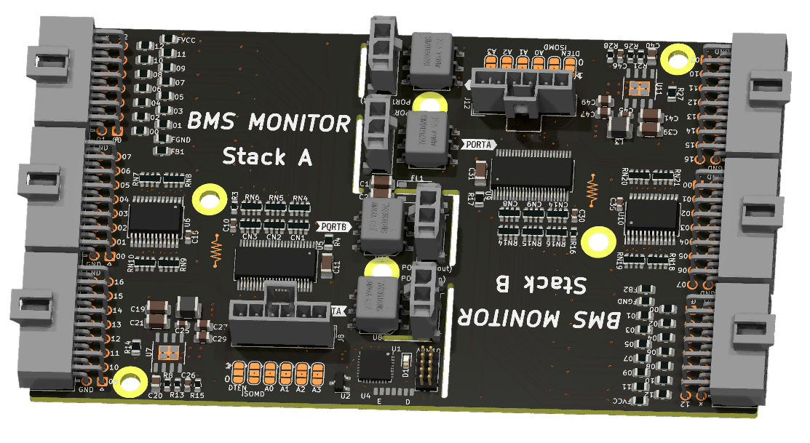

# BMS Monitor

Slave BMS module to monitor 24s cells voltages and temperatures.

## Contributors

_Latest first_

- Filippo Volpe

## Features

- 24 cells series
- 32 temperature measurements
- LTC6811-1/-2 both are compatible
- isoSPI cost effective communication interface to the monitor IC directly
- cell balancing
- STM32L0 can be fitted to add logic to the board by itself
- IRda optional communication to the MCU
- compatible, for temperatures, with both NTC and shunt references
- direct SPI connection to the monitor ICs
- usable as two 12S monitor with breakaway slots
- cost reduction in the isolation components if used as 24S monitor
- small footprint, 65mmx115mm

## Configurations

### LTC6811 -1 vs -2

For use with "-1" version the isoSPI link must be daisy chained, hence connecting the master of PORTB to the slave of PORTA of the next IC in the chain. Populate R5 and R6, don't populate R30 R31.

For use with the "-2" version only populate the slave PORTA of each section and connect them in parallel. Then set the address of each section using the solder jumpers. Populate R30 and R31, don't populate R5 R6.

### 24S monitor

Using LTC6811-1 version.

| Component reference         | To fit  | Comment|
|--------------|-----------|------------|
| R11 |   ✔️    |        |
| R12 |   ✔️    |        |
| C18 |   ✔️    |        |
| U12 |   ❌    |        |
| R22 |   ✔️    |        |
| R23 |   ✔️    |        |
| C37 |   ✔️    |        |
| U13 |   ❌    |        |
| FL1 |   ✔️    |        |
| C1 |   ✔️    |        |
| C2 |   ✔️    |        |

### 12S monitor

The board can be splitted along the cutouts to obtain 2 12S monitors of which one has the option to be used with the MCU but both still has full SPI and isoSPI functionality.
In this case using LT6811 -1 or -2 version won't change any functionality.

### Switching PSU

For a more efficient PSU the voltage can be stepped down using a switching regulator.

| Component reference | To fit  | Comment|
|--------------|-----------|------------|
| Q1 |   ❌    |        |

All other PSU components must be populated.

### Low cost PSU

To power the stack monitor a low component count but less efficient psu can be populated using transistor Q1.

| Component reference         | To fit  | Comment|
|--------------|-----------|------------|
| Q1 |   ✔️    |        |
| R14 |   ✔️    |        |
| C19 |   ✔️    |        |
| C21 |   ✔️    |        |
| C27 |   ✔️    |        |
| C29 |   ✔️    |        |

All other PSU components can be left unpopulated.

### SPI vs isoSPI connection

To use the isoSPI connection, connect ISOMD to 1.
To use the direct SPI connection, connect the ISOMD switch to 0 and the ICMP and BIAS resistor can be left unpopulated.
